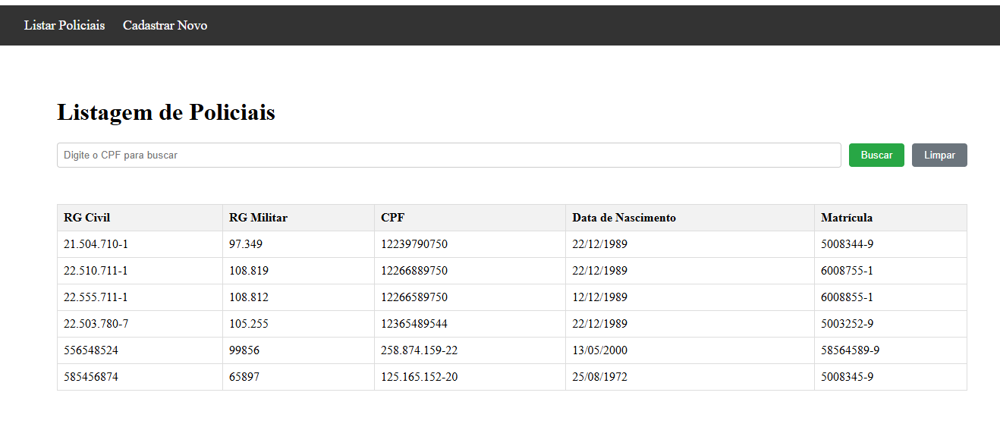
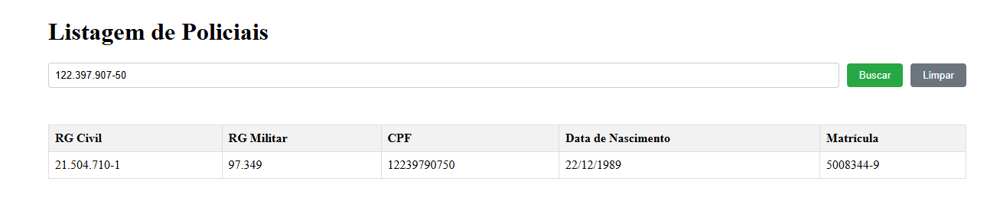
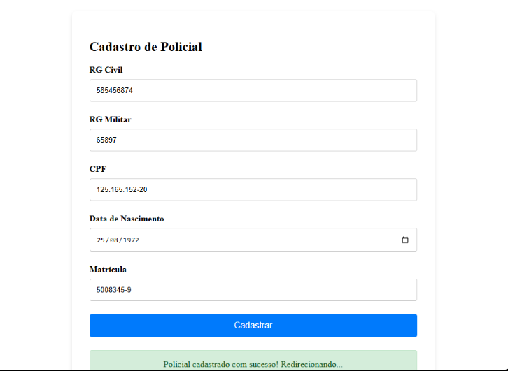

Com certeza! Vamos transformar o README.md em um documento completo e profissional, digno de um portfólio, incorporando suas imagens e adicionando todos os detalhes técnicos relevantes que um outro desenvolvedor (ou um avaliador) esperaria encontrar.

A estrutura abaixo está pronta. Siga as mesmas instruções de antes: crie o arquivo README.md e a pasta screenshots na raiz do seu projeto e cole o conteúdo abaixo.

CRUD de Policiais - Avaliação Full Stack
Tabela de Conteúdos
Sobre o Projeto

1- Demonstração Visual
2- Funcionalidades Principais
3- Arquitetura
4- Tecnologias Utilizadas
5- Documentação da API
6- Instalação e Execução Local
7- Autor
8- Agradecimentos

----- Sobre o Projeto -----

Este projeto consiste em uma aplicação web Full Stack para o gerenciamento de policiais, desenvolvida como parte de um processo de avaliação técnica. O sistema implementa as funcionalidades essenciais de um CRUD (Create, Read, Update, Delete - embora o foco tenha sido no Create e Read), com uma API RESTful segura construída em Node.js/Express e uma interface de usuário reativa e responsiva desenvolvida com Angular (Standalone Components).

O objetivo foi demonstrar competências em todo o ciclo de vida do desenvolvimento de software, desde a modelagem do banco de dados e segurança no back-end até a criação de uma experiência de usuário funcional e intuitiva no front-end.

----- Demonstração Visual ----- 

Listagem e Busca de Policiais
A tela principal apresenta uma lista completa de todos os policiais cadastrados. A interface inclui uma funcionalidade de busca que filtra os resultados em tempo real com base no CPF inserido, utilizando uma máscara de input para facilitar a digitação.

Figura 1: Visão geral da tela de listagem.

Figura 2: Resultado da busca por um CPF específico.

----- Cadastro de Policial -----

O formulário de cadastro foi construído com Angular Reactive Forms, incluindo validações de campos obrigatórios e de formato de CPF. O sistema fornece feedback visual instantâneo para o usuário, exibindo uma mensagem de sucesso após o cadastro e redirecionando-o para a página de listagem.

Figura 3: Formulário de cadastro com mensagem de sucesso após o envio.

Funcionalidades Principais
✅ Cadastro de Policiais: Formulário reativo com validações client-side.

✅ Listagem Completa: Visualização de todos os registros do banco de dados.

✅ Busca por CPF: Filtragem dinâmica da lista de policiais.

✅ Criptografia de Dados Sensíveis: A matrícula do policial é armazenada de forma criptografada (AES-256) no banco de dados e descriptografada para exibição.

✅ Feedback Visual: Mensagens claras de sucesso e erro para o usuário.

✅ Layout Responsivo: Interface adaptável para desktops e dispositivos móveis.

✅ Comunicação Segura: Requisições HTTP gerenciadas entre o front-end e o back-end com tratamento de erros.

Arquitetura
A aplicação segue uma arquitetura Cliente-Servidor desacoplada:

Back-end (Servidor): Uma API RESTful desenvolvida em Node.js com Express. É responsável por toda a lógica de negócio, validações do lado do servidor, segurança (criptografia) e comunicação com o banco de dados MySQL.

Front-end (Cliente): Uma Single-Page Application (SPA) desenvolvida com Angular. É responsável por toda a camada de apresentação, interações com o usuário, validações de formulário e consumo da API do back-end através de requisições HTTP.

Tecnologias Utilizadas
Categoria	Tecnologia	Descrição
Back-end	Node.js, Express.js	Criação da API e gerenciamento de rotas.
MySQL2	Conexão com o banco de dados relacional MySQL.
DotEnv	Gerenciamento de variáveis de ambiente.
CORS	Permissão de acesso entre domínios diferentes (front-end e back-end).
Crypto (módulo nativo)	Criptografia simétrica AES-256 para a matrícula.
Front-end	Angular	Framework principal para a interface.
Standalone Components	Arquitetura moderna de componentes do Angular.
Reactive Forms	Gerenciamento avançado de formulários e validações.
HttpClient	Módulo para realizar requisições HTTP à API.
ngx-mask	Biblioteca para máscaras de input.
Banco de Dados	MySQL	Sistema de Gerenciamento de Banco de Dados Relacional.

Exportar para Sheets
Documentação da API (Endpoints)
Método HTTP	Endpoint	Descrição	Corpo da Requisição (Body)	Resposta de Sucesso
POST	/policiais	Cadastra um novo policial. Valida duplicidade de CPF/RG.	JSON com os dados do policial	201 Created com o objeto do policial criado.
GET	/policiais	Lista todos os policiais cadastrados.	N/A	200 OK com um array de objetos de policiais.
GET	/policiais?cpf={cpf}	Filtra e retorna policiais com base em um CPF específico.	N/A	200 OK com um array contendo o policial encontrado.

Exportar para Sheets
Instalação e Execução Local
Siga os passos abaixo para configurar e executar o projeto em seu ambiente local.

Pré-requisitos
Node.js (versão 18 ou superior)

Angular CLI (npm install -g @angular/cli)

Servidor de banco de dados MySQL

1. Clone o Repositório
Bash

# Clone este repositório para sua máquina local
git clone (https://github.com/MrMatheusMotta/crud-policiais.git)
cd <NOME_DA_PASTA_DO_PROJETO>
2. Configure o Banco de Dados
SQL

-- Crie um novo banco de dados no seu MySQL
CREATE DATABASE seu_banco_de_dados;
Após criar o banco, execute o script do arquivo backend/banco.sql para criar a tabela policiais.

3. Configure o Back-end
Bash

# Navegue até a pasta do back-end
cd backend

# Crie um arquivo .env na raiz desta pasta e preencha com suas credenciais.
# Use o arquivo .env.example como base.

# Instale as dependências
npm install

# Inicie o servidor do back-end
npm run dev

# O servidor estará rodando em http://localhost:3000
4. Configure o Front-end
Bash

# Abra um NOVO TERMINAL
# Navegue até a pasta do front-end a partir da raiz do projeto
cd frontend

# Instale as dependências
npm install

# Inicie a aplicação Angular
ng serve

# A aplicação estará disponível em http://localhost:4200
Autor
3º SGT PM 97349 MATHEUS HENRIQUE MOTTA RIBEIRO

Agradecimentos
Este projeto foi desenvolvido como parte de um processo de avaliação. Agradecimentos especiais à inteligência artificial Gemini (Google), que foi utilizada como um instrumento de busca e orientação para a resolução de dúvidas, depuração de código e implementação de boas práticas durante todo o ciclo de desenvolvimento.